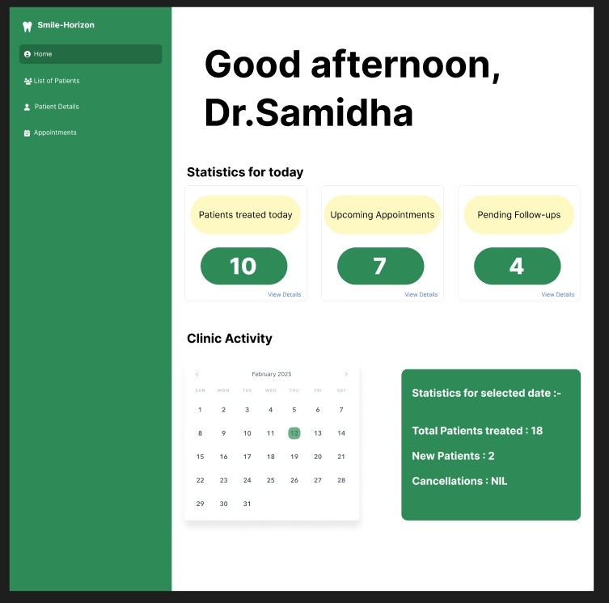

# SmileHorizon - Dental Clinic Management System

## Overview

SmileHorizon is a comprehensive Django-based dental clinic management system designed to streamline the daily operations of a dental practice. The system includes patient management, appointment scheduling, treatment records, and prescription management capabilities.



## Table of Contents

1. [System Architecture](#system-architecture)
2. [Installation Guide](#installation-guide)
3. [Project Structure](#project-structure)
4. [Database Models](#database-models)
5. [Features & Functionality](#features--functionality)
6. [User Guide](#user-guide)
7. [Contributing Guidelines](#contributing-guidelines)
8. [Future Enhancements](#future-enhancements)

## System Architecture

SmileHorizon is built using the following technologies:

- **Backend**: Django 4.2+ (Python web framework)
- **Database**: SQLite (default for development, configurable for PostgreSQL, MySQL, etc. for production)
- **Frontend**: HTML, CSS, JavaScript with Bootstrap 5
- **Authentication**: Django's built-in authentication system

The application follows the standard Django MTV (Model-Template-View) architecture:
- **Models**: Define the database structure
- **Templates**: Handle the presentation layer
- **Views**: Contain the business logic

## Installation Guide

### Prerequisites

- Python 3.8+
- pip (Python package installer)
- Git

### Setup Instructions

1. **Clone the repository**

```bash
git clone https://github.com/Ghostblaster08/Smile_Horizon.git
cd Smile_Horizon
```

2. **Create and activate a virtual environment**

```bash
python -m venv env
```

- **On Windows:**

```bash
env\Scripts\activate
```

- **On macOS/Linux:**

```bash
source env/bin/activate
```

3. **Install dependencies**

```bash
pip install -r requirements.txt
```

4. **Apply migrations**

```bash
python manage.py migrate
```

5. **Create a superuser**

```bash
python manage.py createsuperuser
```

6. **Run the development server**

```bash
python manage.py runserver
```

7. **Access the application**

- Main site: [http://127.0.0.1:8000/](http://127.0.0.1:8000/)
- Admin site: [http://127.0.0.1:8000/admin/](http://127.0.0.1:8000/admin/)

## Project Structure

```
Smile_Horizon/
├── Smile_Horizon/          # Main project directory
│   ├── settings.py         # Project settings
│   ├── urls.py             # Main URL configuration
│   └── ...
├── User/                   # User management app
│   ├── models.py           # User model (extends Django's AbstractUser)
│   ├── views.py
│   └── ...
├── Patient/                # Patient management app
│   ├── models.py           # Patient, MedicalHistory, Document models
│   ├── views.py            # Patient-related views
│   ├── forms.py            # Patient-related forms
│   ├── urls.py             # URL patterns for patient views
│   └── ...
├── Appointment/            # Appointment management app
│   ├── models.py           # Appointment, TreatmentRecord models
│   ├── views.py            # Appointment-related views
│   ├── forms.py            # Appointment-related forms
│   ├── urls.py             # URL patterns for appointment views
│   └── ...
├── Prescription/           # Prescription management app
│   ├── models.py           # Medicine, Prescription models
│   └── ...
├── core/                   # Core app for dashboard and shared functionality
│   ├── views.py            # Dashboard view
│   ├── urls.py             # URL patterns for core views
│   └── ...
├── templates/              # Global templates
│   ├── base.html           # Base template with common layout
│   ├── core/               # Templates for core app
│   ├── patient/            # Templates for Patient app
│   └── ...
├── static/                 # Static files (CSS, JavaScript, images)
└── media/                  # User-uploaded files (patient documents, etc.)
```

## Database Models

### User App
- **User**: Extends Django's AbstractUser to include additional fields for doctors and staff.

### Patient App
- **Patient**: Contains patient information.
- **MedicalHistory**: Stores patient medical history records.
- **Medication**: Tracks current and past medications for patients.
- **Document**: Stores patient documents (x-rays, reports, etc.).

### Appointment App
- **TreatmentType**: Defines types of dental treatments offered.
- **Appointment**: Manages patient appointments.
- **TreatmentRecord**: Records treatments performed on patients.

### Prescription App
- **Medicine**: Stores information about commonly prescribed medicines.
- **Prescription**: Links appointments with prescribed medicines.
- **PrescribedMedicine**: Through model for Prescription and Medicine.

## Features & Functionality

- **Dashboard Features**: Overview of daily statistics, weekly calendar view.
- **Patient Management**: Registration, medical history, document management.
- **Appointment System**: Scheduling, status tracking, calendar view.
- **Treatment Management**: Record treatments, view history, schedule follow-ups.
- **Prescription System**: Medicine database, prescription creation.

## User Guide

### User Roles
- **Doctors**: Full access to patient information, appointments, treatments.
- **Staff**: Limited access for patient registration and appointment scheduling.

### Common Tasks
- **Creating a Patient**: Fill in the patient information form and save.
- **Scheduling an Appointment**: Select date, time, treatment type, and save.
- **Recording a Treatment**: Enter details and follow-up information.
- **Creating a Prescription**: Select medicines, enter dosage, and save.

## Contributing Guidelines

### Development Setup
1. Fork the repository.
2. Create a feature branch:

```bash
git checkout -b feature/your-feature-name
```

3. Implement changes, write tests, and run:

```bash
python manage.py test
```

4. Submit a pull request.

### Coding Standards
- Follow PEP 8 for Python code.
- Use descriptive variable and function names.
- Include docstrings for modules, classes, and functions.

## Future Enhancements

- **Billing and Invoicing Module**: Generate invoices, track payments.
- **Patient Portal**: Online appointment booking, secure messaging.
- **Advanced Reporting**: Treatment success rates, revenue analysis.
- **Inventory Management**: Track dental supplies, automated reordering.
- **Mobile Application**: iOS/Android support, push notifications.
- **Integration with Dental Imaging Systems**: Direct import of X-rays.

---
_Last Updated: March 1, 2025_

**© 2025 SmileHorizon - Developed by Ghostblaster08**

